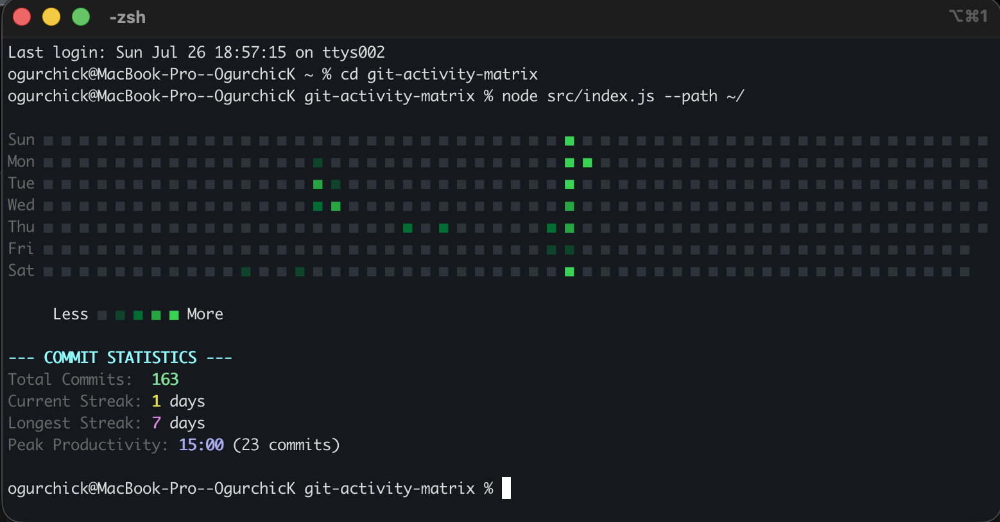

# git-activity-matrix

> A fast, zero-dependency CLI tool to analyze local Git commits, track productivity streaks, and render contribution heatmaps directly in your terminal


---

## Overview

<p align="center">
  
</p>

---

## Key Features

- **Multi-Repository Discovery:** Automatically scans target directories and subfolders for local `.git` repositories.
- **Terminal Heatmap Grid:** Renders a full 52-week contribution matrix matching exact day-of-week alignment.
- **Theme System:** Seamlessly switch color palettes (`github`, `cyberpunk`, `monokai`).
- **Productivity Analytics:**
  - Total annual commit count.
  - Active daily streaks (current and longest).
  - Peak productivity hour detection (Peak Hour Analysis).
- **Zero External Runtime Heavyweights:** Pure Node.js and standard Git binary integration.

---

## Installation

Install the package globally on your system via npm:

```bash
npm install -g .
```

Or link it locally for active development:

```bash
npm link
```

---

## Quick Start & Usage

Once installed, the `gmatrix` command becomes available globally in your terminal.

### 1. Analyze Current Project
Run directly inside any Git repository to scan its local history:

```bash
gmatrix
```

### 2. Scan Workspace / All Repositories
Pass a path to scan all subdirectories for `.git` repositories (for example, your entire home directory or projects folder):

```bash
gmatrix --path ~/
```

---

## Command Line Options

Customize output using flags:

| Option | Description | Default |
| :--- | :--- | :--- |
| `--path <path>` | Root directory path to search for Git repositories | Current working directory |
| `--year <year>` | Target calendar year for analysis | Current year |
| `--theme <name>` | Visual color scheme (`github`, `cyberpunk`, `monokai`) | `github` |
| `--help` | Print CLI documentation and exit | `false` |

---

## Usage Examples

Run with Cyberpunk color theme:

```bash
gmatrix --theme cyberpunk
```

Analyze all local repositories in a custom directory for year 2025:

```bash
gmatrix --path ~/Projects --year 2025 --theme monokai
```

---

## Examining Commit History

This project was built step-by-step using modular architecture practices. You can review the commit history and inspect feature-by-feature evolution using standard Git commands:

```bash
# View concise commit history log
git log --oneline --graph

# Inspect changes in a specific commit
git show <commit-hash>
```

---

## License

Distributed under the MIT License. See LICENSE for more details.

